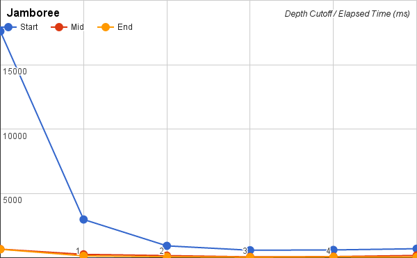
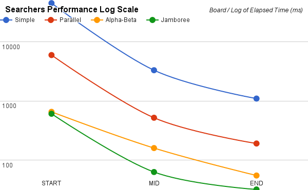

# Project 3 (Chess) Write-Up #
--------

## Project Enjoyment ##
- How Was Your Partnership?
  <pre>
    David: GOOD.
    Allen: Ditto.
</pre>
  
- What was your favorite part of the project?
  <pre>
    David: When we paired up to implement each of the various searchers, we
        made very quick work of it and had almost no issues. It was a good
        feeling.
    Allen: When we started to beat clamps.
</pre>

- What was your least favorite part of the project?
  <pre>
    David: Spending hours tweaking/evaluating half-baked Jamboree "improvements". (!) We ended up with 4 "experimental" branches that didn't get used.
    Allen: The suspense while watching our bot play against clamps to see if they would barely win or lose near the end.

</pre>

- How could the project be improved?
  <pre>
    It would be great if there was some tool included that gave your search implementation a quality or
      competitiveness metric. (The included JamboreeTests script isn't very informative.) (Rematching against
      clamps also isn't that informative -- something deterministic would be great.)
</pre>

- Did you enjoy the project?
  <pre>
    David: Overall, yes, this was good. Game playing algorithms seem like a pretty generally useful
    mechanism for a wide variety of things.
    Allen: I enjoyed how interactive this project was.
</pre>
    
-----

## The Chess Server ##
- When you faced Clamps, what did the code you used do?  Was it just your jamboree?  Did you do something fancier?
  <pre>
  We've made a SuperJamboreeSearcher where we've implemented move ordering and iterative deepening.
  </pre>

- Did you enjoy watching your bot play on the server?  Is your bot better at chess than you are?
  <pre>
  Yes, we greatly enjoyed watching our bots play. We've mentioned how it makes us want to better understand
  chess so that we can play it on our own.
  The gameplay was especially fun to watch when we were fixing some of our first big jamboree bugs. That is,
  to see the bot transition from making terrible self-defeating decisions, to actually smart decisions based on
  six levels of speculation, was exciting.
  
  Our bot is usually wiser than us.
  </pre>

- Did your bot compete with anyone else in the class?  Did you win?
  <pre>No, we didn't play against any of the other classmates. (None of them responded when we tried to play them.)</pre>

- Did you do any Above and Beyond?  Describe exactly what you implemented.
  <pre>We've implemented a few enhancements that *might* beat Clamps 10/10 times, but we haven't tried yet.</pre>

## Experiments ##

### Chess Game ###

#### Hypotheses ####
Suppose your bot goes 3-ply deep.  How many game tree nodes do you think
it explores (we're looking for an order of magnitude) if:
 - *...you're using minimax?*
 
   All of the nodes. For an average branching factor of 35, this is about 35^3.
    (~40,000 nodes -- **10^4 order of magnitude**.)
    
 - *...you're using alphabeta?*
   Since alphabeta prunes a percentage of branches from each level, this will look like
    (35-p)^3 where p is the number of nodes pruned from a level of searching.
    If alphabeta was to prune, on average, 15 nodes from a level, we'd be examining
    roughly (35-15)^3 = 20^3 = 8,000 nodes: a **10^3 order of magnitude**.

Run an experiment to determine the actual answers for the above.  To run
the experiment, do the following:
1. Run SimpleSearcher against AlphaBetaSearcher and capture the board
   states (fens) during the game.  To do this, you'll want to use code
   similar to the code in the testing folder.
2. Now that you have a list of fens, you can run each bot on each of them
   sequentially.  You'll want to slightly edit your algorithm to record the
   number of nodes you visit along the way.
3. Run the same experiment for 1, 2, 3, 4, and 5 ply. And with all four
   implementations (use ply/2 for the cut-off for the parallel
   implementations).  Make a pretty graph of your results (link to it from
   here) and fill in the table here as well:

**Here** are the most damning and interesting graphs.

For the first two, the x axis is move number, and the y axis is the number of nodes explored.
The different `ply` values produced such dramatic differences that log scale was necessary in order to show the sub-5 ply results.
The most **crucial** thing to note here is the difference in scale of the y-axis between the two graphs!

*(Minimax and Parallel Minimax had identical node visit counts, so the Parallel Minimax graph has been omitted.)*

*(Similarly, Jamboree's node visit counts are just a small percentage greater than Alpha-Beta, so its graph is basically identical to that of Alpha-Beta.)*

.

.

Finally, we placed the node exploration counts of each searcher at `ply=5` on the same graph.
Notice how relatively few nodes are examined by the pruning searchers. This basically proves that minimax is a **non-starter**
for chess at higher ply levels:

Since Minimax is so dominant (slow) in this graph, the log scale is more informative:

*Median values:*

|      Algorithm     | 1-ply | 2-ply | 3-ply | 4-ply | 5-ply |
| :----------------: |:-----:|:-----:|:-----:|:-----:|:-----:|
|       Minimax      | 32  |  925 |  29417 | 887258  | 29334790  |
|  Parallel Minimax  | 32  |  925 |  29417 | 887258  | 29334790  |
|      Alphabeta     | 32  |  314 |  5371 | 47392  | 583773  |
|      Jamboree      | 32  |  339 |  5726 | 53414  | 601773  |

(Note: the above figures are median values from generating a move
from the 64 pre-generated board FEN strings.)

*Orders of magnitude:*

|      Algorithm     | 1-ply | 2-ply | 3-ply | 4-ply | 5-ply |
| :----------------: |:-----:|:-----:|:-----:|:-----:|:-----:|
|       Minimax      | 10^1  |  10^2 |  10^4 | 10^5  | 10^7  |
|  Parallel Minimax  | 10^1  |  10^2 |  10^4 | 10^5  | 10^7  |
|      Alphabeta     | 10^1  |  10^2 |  10^3 | 10^4  | 10^5  |
|      Jamboree      | 10^1  |  10^2 |  10^3 | 10^4  | 10^5  |

#### Conclusions ####
*How close were your estimates to the actual values?  Did you find any
entry in the table surprising?  Based ONLY on this table, do you feel
like there is a substantial difference between the four algorithms?*

Our hypotheses were very good in terms of orders of magnitude, and
we're happy to report that the entries in these tables are not very surprising:
Minimax and parallel minimax are identical, Alpha-Beta is able to look at
FAR fewer nodes, and Jamboree (which ran much faster than Alpha-Beta) ends up looking at
a few more nodes than Alpha-Beta.

We conclude from the above tables that since Alpha-Beta and Jamboree can evaluate **multiple**
orders of magnitude fewer decision nodes, that these pruning algorithms are basically **essential**
for a chess bot. Indeed, as the `ply` values grow to 6 and beyond, the disparities between
these algorithms will only widen. So yes, I conclude that there is a substantial runtime
difference between the pruning algorithms and the variants of Minimax.

### Optimizing Experiments ###

#### Sequential Cut-Offs ####
Experimentally determine the best sequential cut-off for both of your
parallel searchers.  You should test this at depth 5.  If you want it
to go more quickly, now is a good time to figure out Google Compute
Engine.   Plot your results and discuss which cut-offs work the best on each of
your three boards.

##### Setup #####
Ply = 5, DivideCutoff = 5, PercentSequential = 10%

START Board = `r1bqk1nr/pp1pbppp/4p3/1np1Q3/4P3/P1N2N2/1PPP1PPP/R1BK3R w kq -`

MID Board = `rn2k1nr/p2p1ppp/1p2p3/8/3PP3/3P1N2/P3KPPP/q4B1R w kq -`

END Board = `r4rk1/p1n3pp/8/2b4Q/1p3P2/8/P4R1P/4q1K1 w Hh -`

##### Results #####

For both JamboreeSearcher and ParallelSearcher, the optimal depth cutoff seems to
be at depth = 3 on all three boards. Intuitively this result makes sense as it is in between fully sequential (depth cutoff = 5) and fully parallel (depth cutoff = 0). MID and LOW boards for both Jamboree and Parallel are took significantly less time  because there were less pieces on the board which means that the move list is smaller.

#### Number Of Processors ####
> Now that you have found an optimal cut-off, you should find the optimal
    number of processors. You MUST use Google Compute Engine for this
    experiment. For the same three boards that you used in the previous 
    experiment, at the same depth 5, using your optimal cut-offs, test your
    algorithm on a varying number of processors.  You shouldn't need to test all 32
    options; instead, do a binary search to find the best number. You can tell the 
    ForkJoin framework to only use k processors by giving an argument when
    constructing the pool, e.g., `ForkJoinPool POOL = new ForkJoinPool(k);`

The optimal number of processors for `JamboreeSearcher` seems to be 8. After 8 processors, the performance (measured in elapsed time) plateaus some variance in the MID and END boards.

The optimal number of processors for ParallelSearcher seems to be 7. After 7 processors,
the performance plateaus with some variance in the MID and END boards.

We notice that in both searchers, the elapsed time plateaus as we increase the number of processors.
This can be explained with Amdahl's law, where the time it takes to run the sequential code
is the bottleneck of the program even as # of processors increases.

#### Comparing The Algorithms ####
> Now that you have found an optimal cut-off and an optimal number of processors, 
    you should compare the actual run times of your four implementations. You MUST
    use Google Compute Engine for this experiment (Remember: when calculating
    runtimes using *timing*, the machine matters).  At depth 5, using your optimal 
    cut-offs and the optimal number of processors, time all four of your algorithms
    for each of the three boards.

### Results ###

|      Algorithm     | Early Game | Mid Game | End Game |
| :----------------: |:----------:|:--------:|:--------:|
|       Minimax      |    44791   |   3300   |   1096   |
|  Parallel Minimax  |    5951    |   520    |   191    |
|      Alphabeta     |    654     |   160    |   55     |
|      Jamboree      |    607     |   63     |   32     |

As expected, Minimax > Parallel > Alphabeta > Jamboree with regard to time.
The surprising thing is that Alphabeta and Jamboree on the START board have very
similar times. We would expect that Jamboree would take less time because it is
makes use of parallelism and uses the optimal sequential processors and depth cutoff values.
This could be just an instance of a poor starting board for Jamboree.

### Beating Traffic ###
> In the last part of the project, you made a very small modification to your bot
 to solve a new problem.  We'd like you to think a bit more about the
 formalization of the traffic problem as a graph in this question.

> - To use Minimax to solve this problem, we had to represent it as a game. In
  particular, the "states" of the game were "stretches of road" and the valid
  moves were choices of other adjacent "stretches of road".  The traffic and
  distance were factored in using the evaluation function.  If you wanted to use
  Dijkstra's Algorithm to solve this problem instead of Minimax, how would you
  formulate it as a graph?

  We'd use an directed, weighted cyclic graph where the vertices represent
  locations, and the edges (obviously) represent roads between the locations.

  The weights on these edges are the distances between the vertices they
  connect. However, at runtime, Dijkstra's algorithm will need to be modified
  when out-edges are explored to add the extra "traffic" penalties currently
  computed by `TrafficEvaluator`, since these cannot be statically baked
  into the weights themselves. The product of the traffic and distance figures
  is "time."

  We'd also use the optimization to Dijkstra's algorithm where, if the end node
  N is known, you stop looking once you've dequeued N from the list of
  undiscovered nodes.

> - These two algorithms DO NOT optimize for the same thing.  (If they did,
  Dijkstra's is always faster; so, there would be no reason to ever use
  Minimax.)  Describe the difference in what each of the algorithms is
  optimizing for.  When will they output different paths?

  We have a arrived at a few ways of addressing this question:

#### First, ####
  Dijkstra's algorithm optimizes for a singular minimal "weight" between
  vertices while Minimax optimizes to minimize the worse case scenario.
  
  In this case, minimax is minimizing the amount of traffic it has to face when
  going from A to B.
  Dijkstra is minimizing the time (a function involving speed limit and traffic) to get from A to B.

  Minimax might output a path with minimal traffic but with slow speed limits while Dijkstra 
  will output a path with higher speed limit but more traffic.  
  
  Consider the spot where two paths fork on a street and let that be our start destination. Then down the road
  the two paths join back together, call that our end destination. We will differentiate the two paths as 
  Path A and Path B where both paths have the same distance. Consider Path A has a speed limit of 25mph and virtually no traffic so a car can travel 25mph on this road. Consider Path B has a speed limit of 50mph but the traffic is horrible so a car realistically travels 35mph on this road. Path A gets to the destination with the least amount of traffic while Path B gets to the destination in the quickest amount of time. The minimax algorithm will choose Path A because it has the minimum amount of traffic while the Dijkstra algorithm would choose Path B because it minimizes the time while driving.
  

#### Second, ####
Minimax is reliable for a game like chess because there are a finite number of
   moves the opponent can make, and we can exhaustively enumerate these moves to find the best possible game outcome.
   In nature, or in traffic, there is no such set of discrete possible moves. It's more like a real-valued
   function that we can't fully explore. Thus, we can only make a likely guess at what nature/traffic would do.
   
   Of course if we *DO* have access to live traffic data for each edge, we can factor
   that into the edge weights and
   run Dijkstra's on the graph.

#### Third, ####
The choice between algorithms will need to take into consideration changing traffic
    patterns during the trip. If I give Minimax a time budget of 20 minutes but run into
    gridlock traffic after 15 minutes, none of the trip-terminating routes will finish within the
    alotted time budget, and Minimax will stop returning useful directions.
    
   With Dijkstra's, however, the full path will be computed before you begin the trip, and while
   you may hit the same traffic, you will at least make it to your destination.
